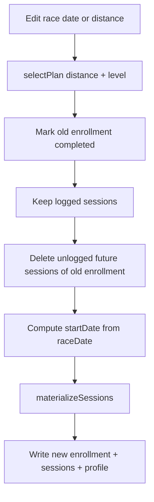

# Phase 2 polish + editable race settings

## Locked decision

Editing **race date** or **race type (distance)** rematerializes the calendar so the plan **ends on race day**. Past **logged** sessions stay as history under the old enrollment; unlogged future sessions are replaced. Experience level stays as-is unless we later add an editor for it.

**Scheduling rule** (shared by onboarding + edits) in [`lib/plans.ts`](lib/plans.ts):

```ts
idealStart = raceDate - (plan.weeks * 7)
startDate = max(idealStart, today)
// If race is sooner than full plan length: keep the *last* N weeks of templates
// so taper/race prep remains, mapped onto [startDate, raceDate]
```

Today’s bug: [`completeOnboarding`](lib/userData.ts) always uses `startDate = today` and ignores `raceDate`.



## 1. Scheduling + re-enroll API

**[`lib/plans.ts`](lib/plans.ts)**
- Add `computePlanStartDate(raceDate, planWeeks, today?)` and optionally `weeksToGenerate` / week-offset when race is soon.
- Extend `materializeSessions` to accept `weekOffset` (skip early template weeks when truncated).

**[`lib/userData.ts`](lib/userData.ts) + [`lib/localStore.ts`](lib/localStore.ts)**
- Fix `completeOnboarding` / `localCompleteOnboarding` to use race-aligned `startDate`.
- Add `updateRaceSettings(uid, { raceDate, raceDistance })`:
  1. `selectPlan(raceDistance, profile.experienceLevel)`
  2. Mark current enrollment `status: 'completed'`
  3. Delete sessions where `enrollmentId === active` AND `logStatus == null` AND `scheduledDate >= today` (Firestore batch / local filter)
  4. Create new enrollment + materialize full (or truncated) calendar
  5. Merge profile: `raceDate`, `raceDistance`, `activePlanId`, `activeEnrollmentId`
- Change `listSessions` consumers for Today/Week/Plan **active calendar** to prefer `activeEnrollmentId`, while still allowing history if needed (default UI: active enrollment only + any logged orphans from prior enrollments dated ≤ today is unnecessary if we keep logged old sessions — show **active enrollment sessions only** on Today/Week; Plan can note “history kept”).

**[`lib/SessionsContext.tsx`](lib/SessionsContext.tsx)**
- Expose `updateRaceSettings` + `refresh` after success.
- Filter displayed sessions to `activeEnrollmentId` (logged history from old enrollments stays in DB but off the main calendar).

## 2. Plan screen editor UI

**[`app/(app)/plan.tsx`](app/(app)/plan.tsx)** — replace read-only overview with editable race block:

- Show current plan name, race date, race distance, weeks remaining.
- **Edit race** control opens an inline form (or modal) reusing onboarding patterns from [`app/(onboarding)/index.tsx`](app/(onboarding)/index.tsx):
  - Distance chips: sprint / olympic / half / ironman
  - Native date picker for race date (today or future)
- Confirm copy: “We’ll rebuild your upcoming schedule so training ends on race day. Logged workouts stay in history.”
- On save → `updateRaceSettings` → refresh profile + sessions → toast/inline success.
- Keep existing Access (free/Pro) and equipment summary cards.

## 3. Phase 2 gaps to close

| Gap | Fix |
|-----|-----|
| Catch-up reopens forever | Persist `catchUpDismissedWeekKey` (ISO week of Mon) on user profile when Apply or “Not now”; `needsCatchUp` only if misses ≥ 2 **and** week key ≠ dismissed. Clear automatically next week. |
| Free logging blocked for week 2+ | On Today/Week: locked sessions still hide **prescription** behind paywall, but **Log** remains available (`router.push(/log/id)` always). Match constitution: logging free. |
| Week flat list | Group [`week.tsx`](app/(app)/week.tsx) by weekday (Mon–Sun headers); keep brick badge via existing `SessionRow`. |
| Catch-up sheet deps | Include `applyCatchUpPlan` correctly in context memo; wire dismiss persistence through Auth/profile update. |

Touch: [`app/(app)/index.tsx`](app/(app)/index.tsx), [`app/(app)/week.tsx`](app/(app)/week.tsx), [`components/CatchUpSheet.tsx`](components/CatchUpSheet.tsx), [`lib/types.ts`](lib/types.ts) (`catchUpDismissedWeekKey?: string` on `UserProfile`).

## 4. Out of scope here

- Editing experience level / weekly hours / equipment (can add later on same Plan screen).
- Auto-marking past unlogged sessions as missed.
- Garmin re-push after rematerialize.
