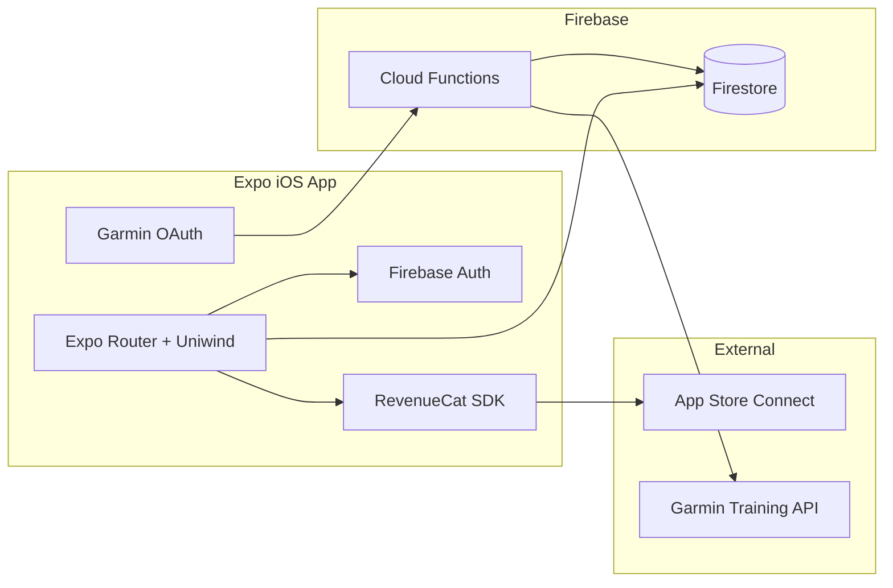

# TriSync Expo MVP Plan

Build from [trisync_constitution.MD](trisync_constitution.MD) as a greenfield **Expo + Firebase + RevenueCat** iOS app. v1 is curated static plans + logging (not an AI engine).

## Locked decisions

- **Platform:** iOS only (Expo, Apple App Store)
- **UI:** Uniwind (Tailwind v4) + React Native Reusables
- **Backend:** New Firebase project (Auth + Firestore + Cloud Functions)
- **Monetization:** RevenueCat — weekly (7-day trial) + yearly; free tier = logging + week-1 plan preview

## Architecture



## Stack

| Layer | Choice |
|---|---|
| App | Expo SDK (latest stable) + Expo Router (file-based) |
| Language | TypeScript |
| Styling | Uniwind + Reusables (`--styling-library uniwind`) |
| Auth | Firebase Auth (Apple Sign-In primary; email optional) |
| Data | Cloud Firestore |
| Server | Cloud Functions (Garmin token exchange, workout push, webhook helpers) |
| IAP | `react-native-purchases` + RevenueCatUI paywall |
| Config | `expo-secure-store` / EAS secrets for keys; public RC/Firebase keys in env |

## Data model (Firestore)

- `users/{uid}` — profile, onboarding answers, active plan id, race date, equipment flags, Garmin connection status
- `plans/{planId}` — curated content (distance × level); seed 8 plans: Sprint/Olympic/70.3/Ironman × Beginner/Intermediate
- `users/{uid}/enrollments/{id}` — start date, week offset, status
- `users/{uid}/sessions/{sessionId}` — scheduled day, discipline (swim/bike/run/brick), prescription text, “why it matters”, log status (`easy` / `on_target` / `hard` / `missed`)
- `users/{uid}/integrations/garmin` — tokens stored server-side only via Functions; client sees connected/disconnected

Plans are authored as JSON (or Firestore docs) with weekly session templates; enrollment materializes the athlete’s calendar from race date + weekly hours.

## App structure (screens)

```
app/
  (auth)/          sign-in
  (onboarding)/    distance → date → level → hours → equipment
  (app)/
    index.tsx      Today — "what do I do and why"
    week.tsx       Weekly swim/bike/run/brick view
    log/[id].tsx   How did it go
    plan.tsx       Active plan overview + free week-1 preview gate
    settings.tsx   Account, Garmin connect, manage subscription
  paywall.tsx      RevenueCat paywall (trial / yearly)
```

Navigation priority matches constitution principle 5: **Today** answers the job before anything else.

## Feature phases

### Phase 0 — Scaffold & design system
- `npx create-expo-app` with Expo Router template
- Uniwind + Tailwind v4 theme tokens (calm, understated; avoid purple/cream AI defaults)
- Reusables primitives (Button, Text, Sheet, Progress)
- EAS project + iOS bundle id (e.g. `com.trisync.app`)
- Create Firebase project, enable Auth (Apple) + Firestore; add iOS app + `GoogleService-Info.plist` via Expo config plugin / `@react-native-firebase` **or** JS SDK `firebase` (prefer **Firebase JS SDK** first for Expo Go speed; move to native modules only if needed for Apple Auth / background)

### Phase 1 — Auth + onboarding + plan library
- Apple Sign-In → Firebase user
- Onboarding wizard → write `users/{uid}`
- Seed 8 static plans; enrollment picks plan and generates first N weeks of `sessions`
- Free tier: full logging UI + only week 1 of plan visible; rest gated

### Phase 2 — Today / Week / Logging + adaptive rule
- Today + Week screens with discipline-aware layout (brick as first-class)
- Manual log: easy / on target / hard / missed
- Rule: **2+ missed in a calendar week** → show catch-up recommendation sheet (simplify next 2–3 sessions; no full re-plan)

### Phase 3 — RevenueCat
- Create RC project + App Store app + Test Store for sandbox
- Products: weekly (7-day trial) + yearly (discounted)
- Entitlement e.g. `pro` unlocks full plan beyond week 1
- Identify user with Firebase `uid` on login (`Purchases.logIn`)
- Paywall via RevenueCatUI; no fake urgency copy (constitution §3.7 / §6)

### Phase 4 — Garmin workout push (v1 table stakes)
- Garmin Connect Developer Program + OAuth (PKCE) via Expo AuthSession
- Cloud Function stores refresh tokens; on schedule/session create, push workout via Garmin Training API
- Settings: Connect / Disconnect Garmin; clear status if token fails
- Scope v1 to **push prescribed workouts**; activity pull can wait

### Phase 5 — Polish & ship
- Calm empty/error states; brand voice in copy
- App Store screenshots, privacy nutrition labels (Health/Garmin disclosures)
- TestFlight → production

## Monetization gating (explicit)

| Free | Pro (`pro` entitlement) |
|---|---|
| Account, logging, history | Full multi-week plan |
| Week 1 of any plan | Adaptive catch-up prompts |
| | Garmin push |

Do **not** gate basic session logging.

## Out of scope for this MVP build

Dynamic AI re-plan, AI pace/power, race recap cards, strength/mobility, community, Android, Apple Watch / Strava (constitution v2+).

## Implementation notes

- Prefer **Firebase JS SDK** + Expo for fastest iOS iteration; use Expo Apple Authentication → custom Firebase token or `OAuthProvider` pattern.
- RevenueCat: configure once at launch; use Test Store until App Store Connect products exist.
- Garmin is the riskiest external dependency — start OAuth + “connected” state early; workout payload mapping can follow once plans exist.
- Keep plan content in versioned JSON under something like `content/plans/` and a seed script into Firestore for easy edits without app releases.
